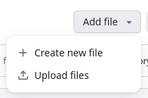
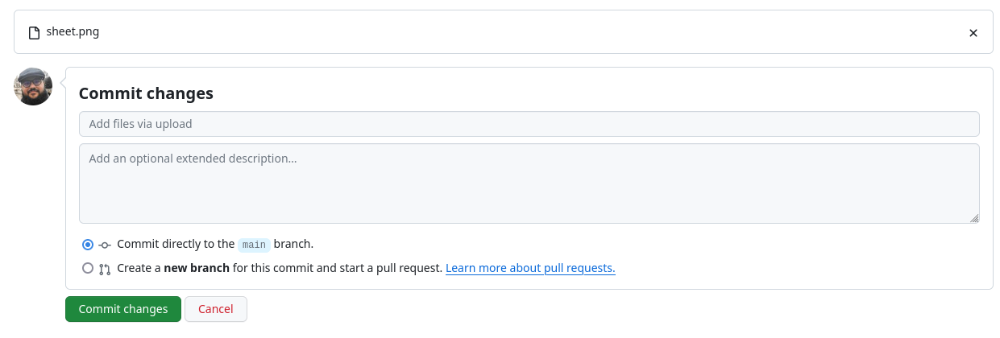
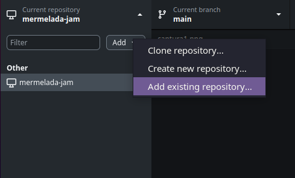
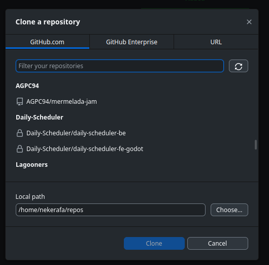
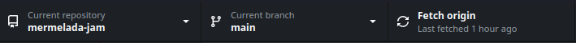
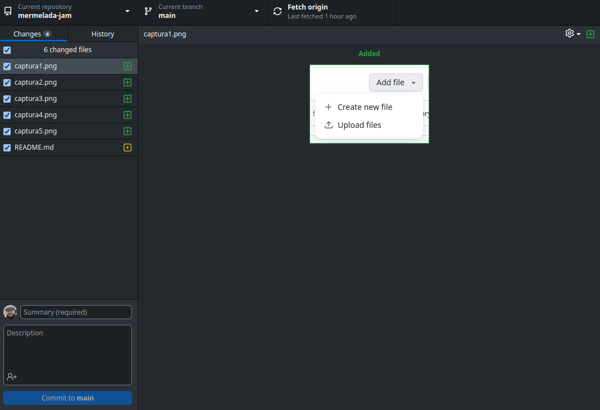

# Mermelada Jam 🍯

Repo para la [Mermelada Jam](https://itch.io/jam/mermelada-jam) de Endorth e Spain Game Devs.

En la carpeta [MermeladaJam1](/MermeladaJam1/) está el proyecto Godot con toda la info del juego.

# Cómo trabajar con Github Web 🧑‍💻

Usad GitHub como si fuera un disco duro, podeis incluir dentro de la carpeta de [MermeladaJam1](/MermeladaJam1/) lo que querais que se incluya en el juego. Para subir un archivo basta con abrir la carpeta y darle a subir ficheros:



Podemos subir archivos desde la nueva interfaz, arrastrando o demás. Una vez hecho con todos los archivos, aceptamos los cambios poniendo un comentario bonito y apachurramos el botón verde:



# Como trabajar con Github Desktop 🖥️

Primeramente clonaremos el repo dandole a Add > Clone repository...:



Podemos conectarnos a nuestra cuenta de GitHub o descargarlo desde la URL:



Lo mejor es conectarse. Luego seleccionamos una ruta local donde se descargará el repo y pulsamos "Clone".

Una vez clonado, veremos que tenemos el repo en local en la rama main:



A partir de aquí, si ponemos archivos o carpetas en la ruta donde se ha bajado (en mi caso /home/nekerafa/repos/mermelada-jam), al abrir GitHub Desktop nos indicará los cambios a hacer:



Podemos añadir los cambios poniendo un commit y pulsando el botón de commit to main.

# Como trabajar con git cli 🗒️

Con git cli no se trabaja, se pelea xd.

Los comandos útiles son:

## Obtener repo

```sh
$ git clone https://github.com/AGPC94/mermelada-jam.git # o git@github.com:AGPC94/mermelada-jam.git si tenemos una clave ssh
```

### Subir y bajar cambios

```sh
$ git pull # Obtiene los cambios del servidor de GitHub
$ git add . # Pasa todos los cambios a staging, es decir, los marca para crear un comentario
$ git commit -m "Comment message" # Crea un comentario con los cambios en staging
$ git push # Envia los cambio al servidor
```

## ramas

```sh
$ git checkout <branch> # cambia a una rama

# ej: pasarse a la rama main
git checkout main
```

```sh
$ git checkout -b <branch> # crea una nueva rama

# ej: crear una rama para una nueva funcionalidad
git checkout -b feature/iconos_municion
```

```sh
$ git merge <branch> # une los cambios de una rama a la rama actual

# ej: obtener los cambios de la rama main
git merge main
```